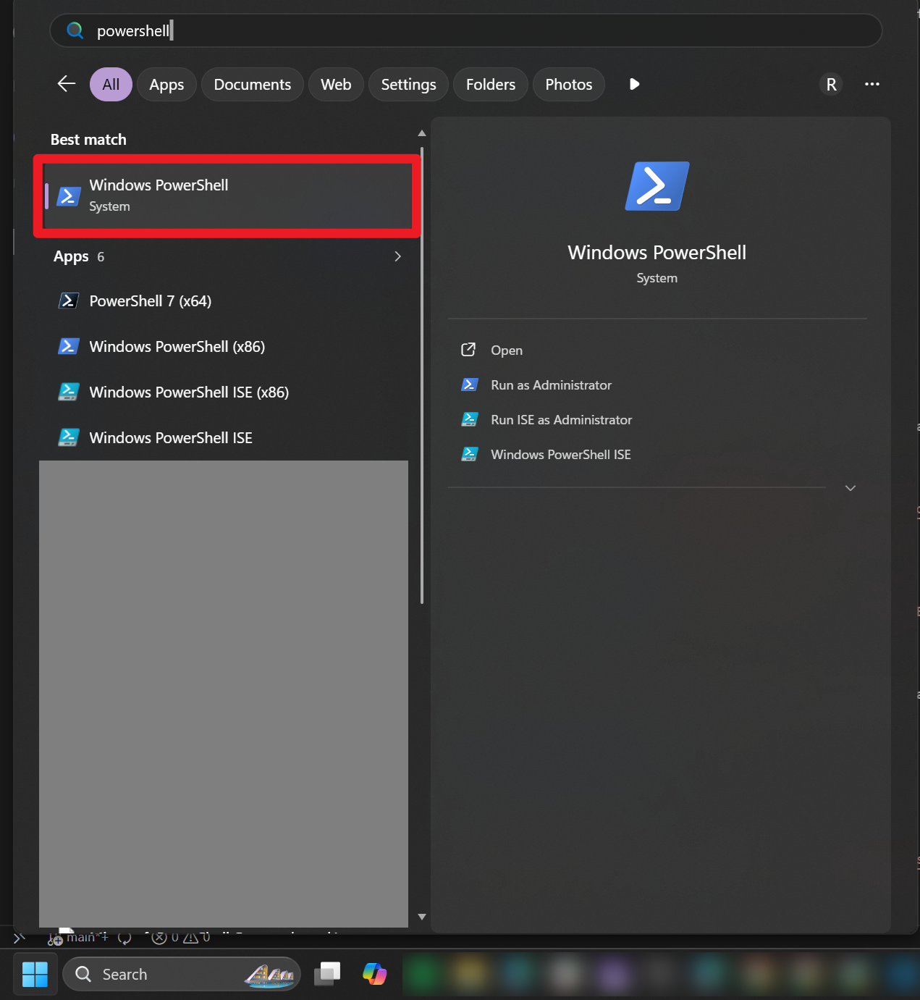
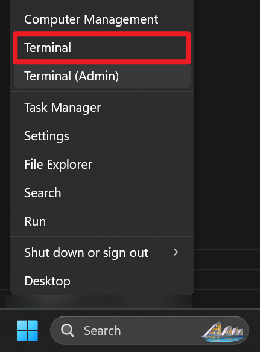
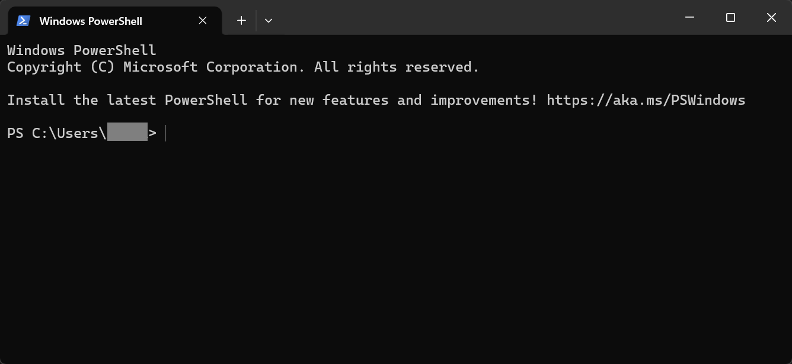
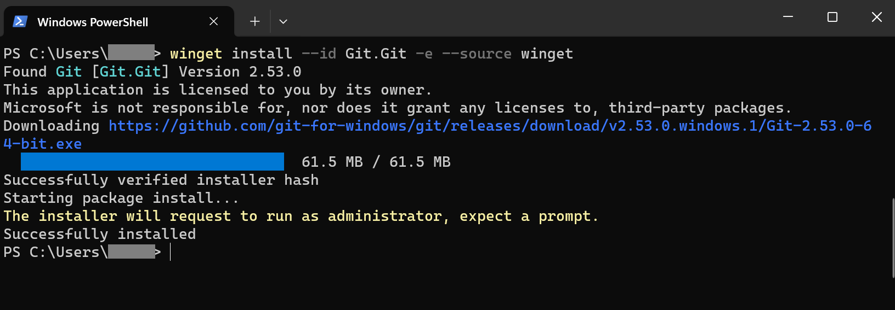
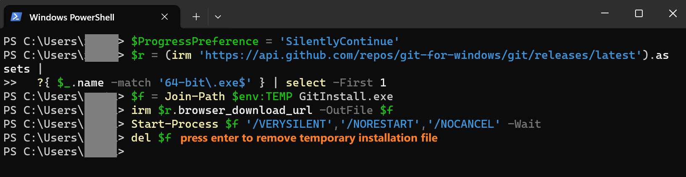
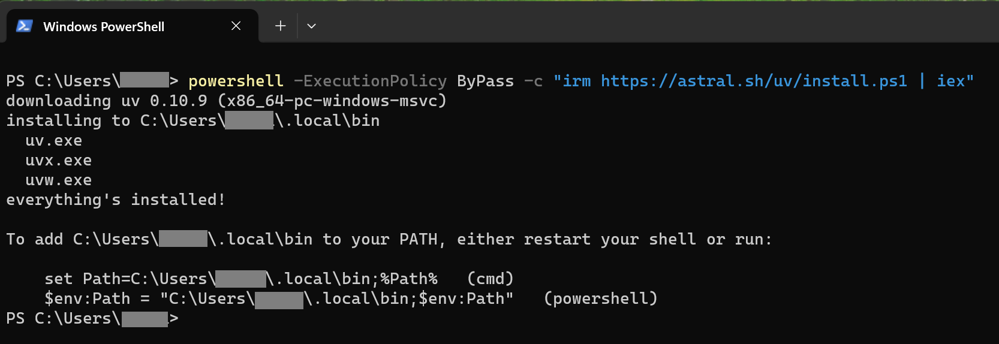
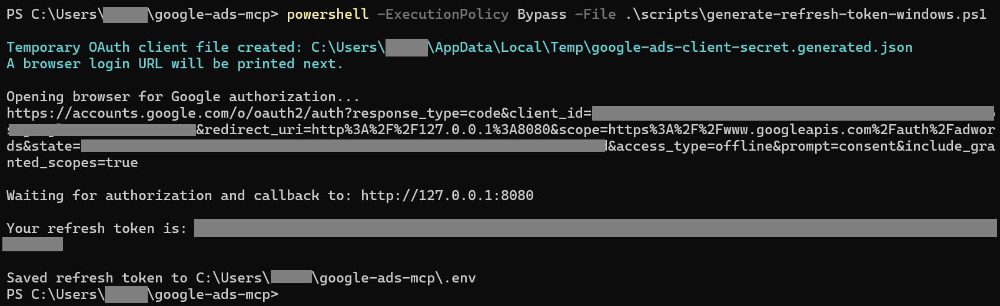
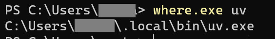

# Google Ads MCP for Claude Desktop on Windows

This guide is for non-technical users. It walks you through installing the MCP server and connecting it to Claude Desktop so that Google Ads tools appear inside Claude.

## What you need before you start

- A Windows computer with Claude Desktop installed
- Credentials from your admin:
  - `GOOGLE_ADS_DEVELOPER_TOKEN`
  - `GOOGLE_ADS_CLIENT_ID`
  - `GOOGLE_ADS_CLIENT_SECRET`
  - `GOOGLE_ADS_LOGIN_CUSTOMER_ID` — optional, only needed if your account is under a manager account
- You will generate `GOOGLE_ADS_REFRESH_TOKEN` yourself in Step 6

If you do not have those values yet, ask your admin first.

## Step 1. Open PowerShell

Click `Start`, type `PowerShell`, then open it.



Or right-click the `Start` button and select `Terminal`.



You should see a window like this:



You will do the whole setup in PowerShell.

## Step 2. Install Git

Copy and paste:

```powershell
winget install --id Git.Git -e
```

Wait until it finishes.

If Windows asks for permission, click `Yes`.



If `winget` is missing or gives an error, copy and paste this instead:

```powershell
$ProgressPreference = 'SilentlyContinue'
$r = (irm 'https://api.github.com/repos/git-for-windows/git/releases/latest').assets |
  ?{ $_.name -match '64-bit\.exe$' } | select -First 1
$f = Join-Path $env:TEMP GitInstall.exe
irm $r.browser_download_url -OutFile $f
Start-Process $f '/VERYSILENT','/NORESTART','/NOCANCEL' -Wait
del $f
```

This downloads the latest Git for Windows installer and runs it silently. Wait until it finishes.



## Step 3. Install uv

Copy and paste (recommended):

```powershell
powershell -ExecutionPolicy ByPass -c "irm https://astral.sh/uv/install.ps1 | iex"
```

OR (alternative, not recommended):

```powershell
winget install --id astral-sh.uv -e
```

Wait until it finishes.



**Then close PowerShell and open it again.**

To confirm `uv` is installed, run:

```powershell
uv --version
```

## Step 4. Download the MCP server

In PowerShell, run:

```powershell
cd $HOME
git clone https://github.com/VidenGlobe/public-google-ads-mcp google-ads-mcp
cd $HOME\google-ads-mcp
```

If you already have this repo on your computer, open that folder instead.

## Step 5. Create the `.env` file

In PowerShell, run:

```powershell
cd $HOME\google-ads-mcp
Copy-Item .env.example .env
notepad .env
```

Notepad will open.

Replace the sample values with your real values for:

- `GOOGLE_ADS_DEVELOPER_TOKEN`
- `GOOGLE_ADS_CLIENT_ID`
- `GOOGLE_ADS_CLIENT_SECRET`
- `GOOGLE_ADS_LOGIN_CUSTOMER_ID`

Leave `GOOGLE_ADS_REFRESH_TOKEN` empty for now — you will generate it in the next step.

Save the file and close Notepad.

## Step 6. Generate `GOOGLE_ADS_REFRESH_TOKEN`

In PowerShell, run:

```powershell
cd $HOME\google-ads-mcp
powershell -ExecutionPolicy Bypass -File .\scripts\generate-refresh-token-windows.ps1
```

Your default browser will open automatically with the Google login page.

1. Sign in with the Google account that has access to Google Ads
2. Click `Allow`
3. The refresh token is saved to `.env` automatically

If you want to use a different browser, run with `-NoBrowser` and copy the link manually:

```powershell
powershell -ExecutionPolicy Bypass -File .\scripts\generate-refresh-token-windows.ps1 -NoBrowser
```



### If the refresh token flow fails

- Make sure you are signing in with the Google account that has Google Ads access
- Make sure your admin gave you the correct `GOOGLE_ADS_CLIENT_ID` and `GOOGLE_ADS_CLIENT_SECRET`
- If you get an OAuth or redirect error, ask your admin to check the Google OAuth app setup
- If port `8080` is already in use, close the app using that port and run the command again

## Step 7. Find your `uv` path

Claude Desktop works best when you give it the full path to `uv.exe`.

In PowerShell, run:

```powershell
where.exe uv
```

Copy the first result.

It will usually look like this:

```text
C:\Users\<YourName>\AppData\Local\Microsoft\WinGet\Links\uv.exe
OR
C:\Users\<YourName>\.local\bin\uv.exe
```




## Step 8. Add the server to Claude Desktop

1. Open Claude Desktop
2. Go to **Settings** > **Developer** > **Edit Config**

Claude will open a file explorer window with `claude_desktop_config.json` highlighted.

3. Open the file in any text editor (Notepad, VS Code, etc.)

The file usually already contains something like this:

```json
{
  "preferences": {
    "coworkScheduledTasksEnabled": false,
    "sidebarMode": "chat",
    "coworkWebSearchEnabled": true
  }
}
```

You need to add a `"mcpServers"` block. Add a comma after the opening `{`, then paste the `"mcpServers"` section so the file looks like this:

```json
{
  "mcpServers": {
    "google-ads": {
      "command": "C:/Users/<YourName>/.local/bin/uv.exe",
      "args": [
        "--directory",
        "C:/Users/<YourName>/google-ads-mcp",
        "run",
        "google-ads-mcp"
      ]
    }
  },
  "preferences": {
    "coworkScheduledTasksEnabled": false,
    "sidebarMode": "chat",
    "coworkWebSearchEnabled": true
  }
}
```

Now replace:

- `C:/Users/<YourName>/.local/bin/uv.exe` with the exact result from `where.exe uv` (use forward slashes `/`, not backslashes `\`)
- `C:/Users/<YourName>/google-ads-mcp` with the real folder where you cloned this repo (also use forward slashes)

Make sure:

- There is a comma between `"mcpServers": { ... }` and `"preferences": { ... }`
- All brackets `{` and `}` are matched
- No trailing commas before a closing `}`

Save the file.

## Step 9. Restart Claude Desktop

This part matters.

1. Fully close Claude Desktop
2. Also close it from the system tray if it is still running
3. Open Claude Desktop again

## Step 10. Check that it worked

Open Claude Desktop and look for the tools icon in the chat box.

If the MCP server is connected, Claude should show Google Ads tools.

You can test with a prompt like:

```text
Show me all campaigns for customer 1234567890
```

Replace `1234567890` with a real Google Ads customer ID.

## Troubleshooting

### Claude does not show any tools

- Fully quit Claude Desktop and open it again
- Re-check `claude_desktop_config.json`
- Make sure the JSON has no extra commas or missing brackets

### `uv` is not found

Run this in PowerShell:

```powershell
where.exe uv
```

Then put that exact path into `claude_desktop_config.json`.

### The server fails to start

Run this in PowerShell:

```powershell
cd $HOME\google-ads-mcp
uv run google-ads-mcp
```

If you see an error, that is the problem Claude Desktop is also hitting.

### The repo is private and `git clone` fails

- Make sure you have access to the repo
- Use the correct Git URL
- If your company uses GitHub login, you may need a GitHub token instead of a password

### Google Ads tools appear, but data does not load

Usually this means one of the Google Ads values in `.env` is wrong or missing.

Check:

- `GOOGLE_ADS_DEVELOPER_TOKEN`
- `GOOGLE_ADS_CLIENT_ID`
- `GOOGLE_ADS_CLIENT_SECRET`
- `GOOGLE_ADS_LOGIN_CUSTOMER_ID`
- `GOOGLE_ADS_REFRESH_TOKEN`

### `uv` installation issues

If the official installer fails, try installing uv from https://docs.astral.sh/uv/getting-started/installation/ or use winget as a fallback:

```powershell
winget install --id astral-sh.uv -e
```

## Fastest option

### Option A — Run directly from the internet (no clone needed)

Open `PowerShell` and paste this single line:

```powershell
powershell -ExecutionPolicy Bypass -c "irm https://raw.githubusercontent.com/VidenGlobe/public-google-ads-mcp/main/scripts/setup-windows-claude-desktop.ps1 | iex"
```

This downloads and runs the script automatically. It will install `git` and `uv`, clone the repo to `$HOME\google-ads-mcp`, and configure Claude Desktop.

### Option B — Run from a local clone

If you have already cloned the repo, open `PowerShell` in that folder and run:

```powershell
powershell -ExecutionPolicy Bypass -File .\scripts\setup-windows-claude-desktop.ps1
```

---

What the script does:

- installs `git` if missing (official installer, winget fallback)
- installs `uv` if missing (official installer, winget fallback)
- clones the repo to `$HOME\google-ads-mcp` if not already present
- creates `.env` from `.env.example` if needed
- opens `.env` in Notepad if it still has placeholder values, then generates `GOOGLE_ADS_REFRESH_TOKEN` automatically
- runs `uv sync`
- updates `claude_desktop_config.json` automatically

What you still need to do yourself:

- make sure Claude Desktop is installed
- paste the credentials you received into `.env` when Notepad opens
- restart Claude Desktop after the script finishes
